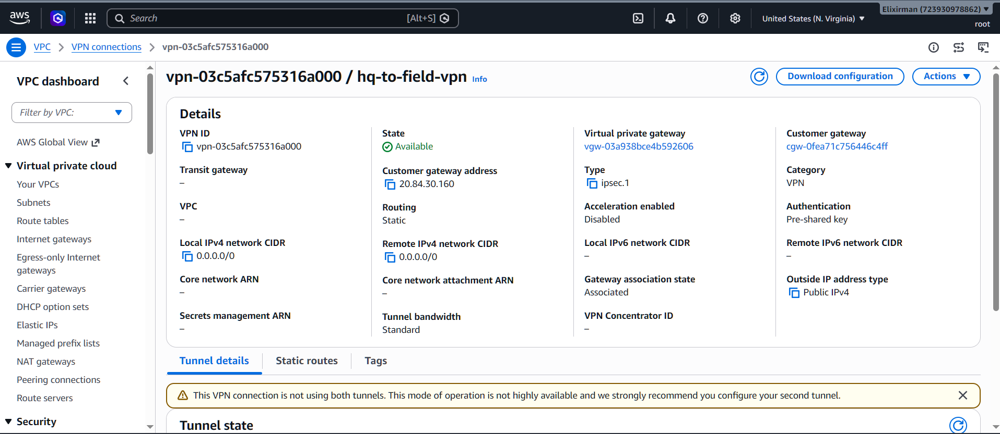
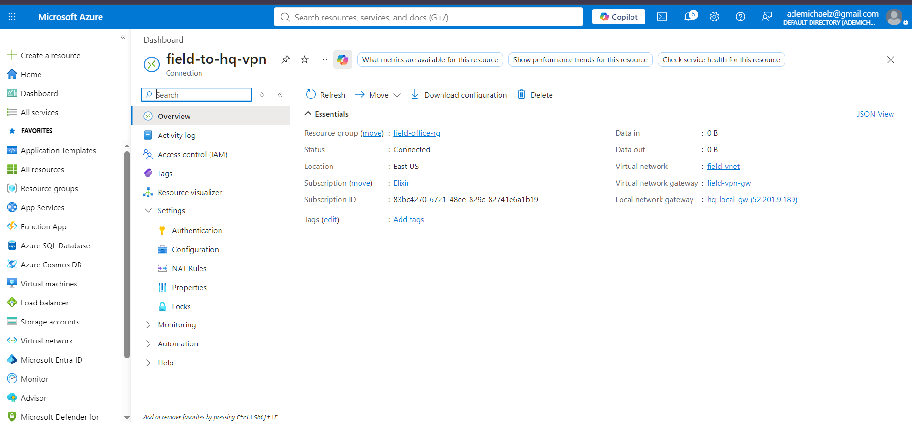
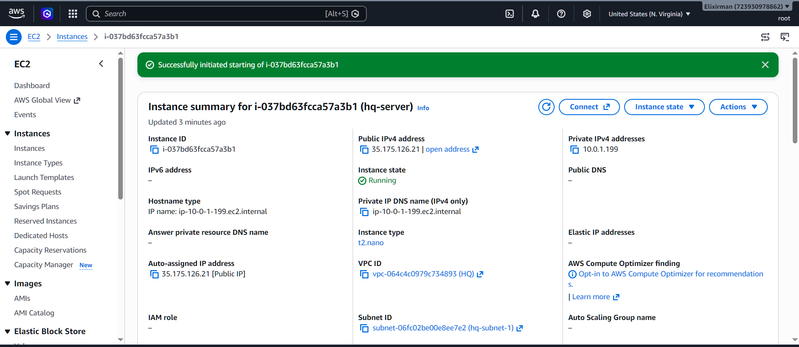
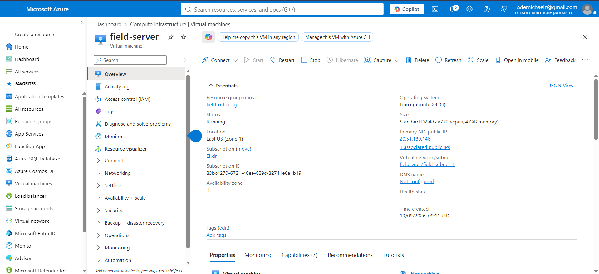
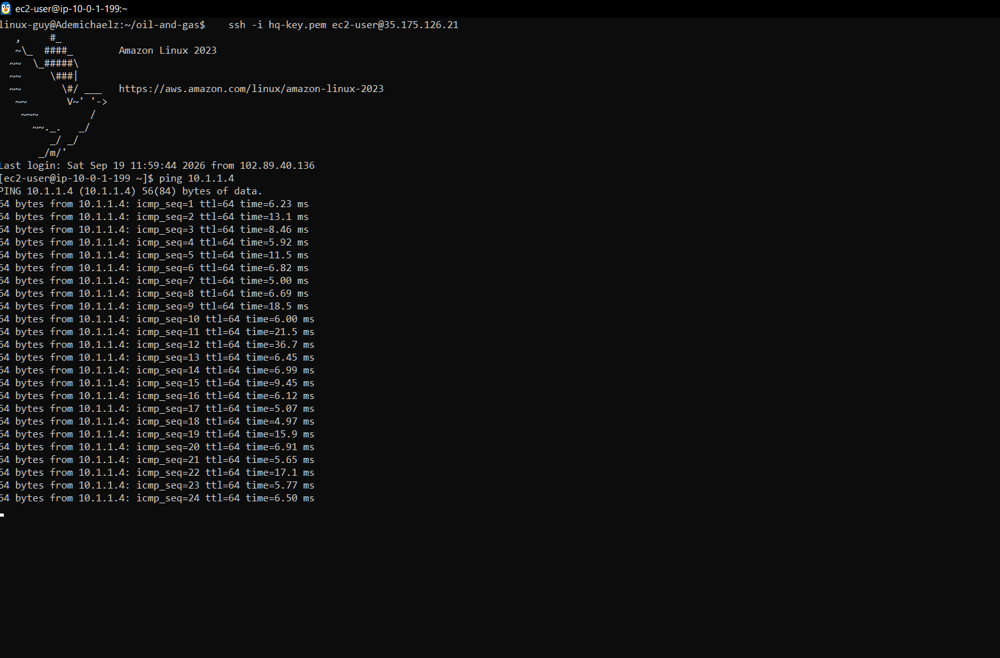
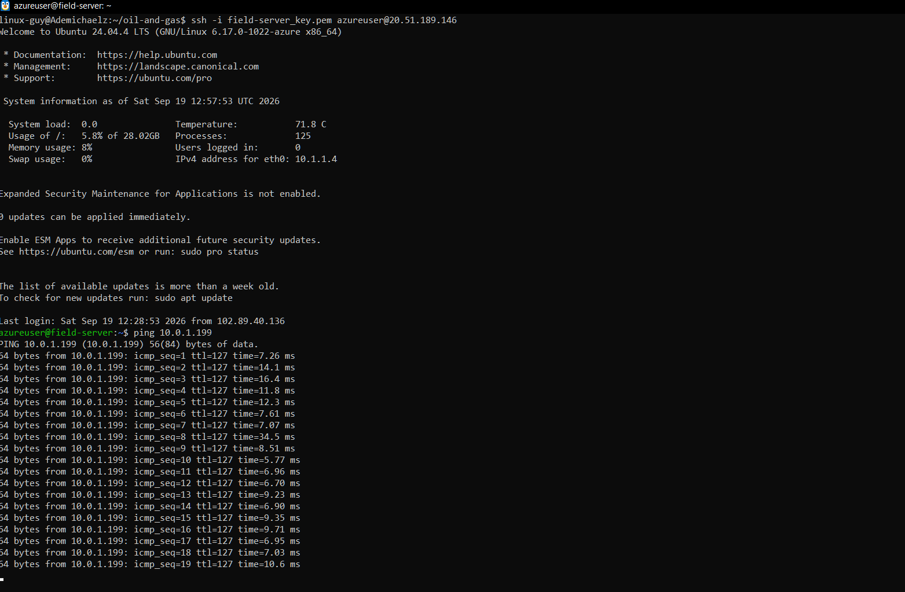

# Project 1: Multicloud Foundation (AWS + Azure)

A hybrid cloud landing zone connecting an AWS "HQ" network to an Azure "Field Office"
network via an encrypted Site-to-Site VPN — simulating how an Oil & Gas company might
link headquarters systems to a remote field/rig site.

🔗 **[View Interactive Simulation](./index.html)** *(hosted via GitHub Pages)*

---

## Architecture Overview

- **AWS (HQ)**: VPC → Subnet → EC2 instance → Virtual Private Gateway
- **Azure (Field Office)**: VNet → Subnet → VM → VPN Gateway
- **Connection**: IPsec Site-to-Site VPN (public internet, encrypted tunnel)

---

## Key Terms & Definitions

| Term | Definition |
|------|------------|
| VPC | Virtual Private Cloud — AWS's isolated network |
| VNet | Virtual Network — Azure's isolated network |
| CIDR | Address range notation (e.g., 10.0.0.0/16) |
| Site-to-Site VPN | Encrypted tunnel connecting two separate networks over the internet |
| PSK | Pre-Shared Key — shared secret used to authenticate the VPN tunnel |
| Route Propagation | Automatic sharing of network routes between gateway and route table |
| NSG | Network Security Group (Azure's firewall equivalent to AWS Security Groups) |

---

## Build Steps

### 1. AWS Side (HQ)
- Created VPC `hq-vpc` (`10.0.0.0/16`)
- Created subnet `hq-subnet-1` (`10.0.1.0/24`)
- Created & attached Internet Gateway (`hq-igw`)
- Added route `0.0.0.0/0 → hq-igw` and associated subnet
- Launched EC2 instance `hq-server` (Amazon Linux, t2.micro)

### 2. Azure Side (Field Office)
- Created VNet `field-vnet` (`10.1.0.0/16`)
- Created subnet `field-subnet-1` (`10.1.1.0/24`)
- Created VM `field-server` (Ubuntu 22.04)
- Configured NSG rules for SSH and ICMP

### 3. VPN Connection (AWS ↔ Azure)
- Created AWS Virtual Private Gateway (`hq-vgw`), attached to `hq-vpc`
- Created Azure VPN Gateway (`field-vpn-gw`, SKU: VpnGw1)
- Created GatewaySubnet manually (`10.1.2.0/27`) — required before gateway deployment
- Created AWS Customer Gateway (`azure-cgw`) using Azure gateway's public IP
- Created AWS Site-to-Site VPN Connection (`hq-to-field-vpn`)
- Downloaded AWS VPN config file → extracted Tunnel 1 IP + Pre-Shared Key
- Created Azure Local Network Gateway (`hq-local-gw`) using AWS tunnel IP
- Created Azure VPN connection (`field-to-hq-vpn`) using matching PSK

### 4. Verification
- Confirmed tunnel status: **Connected** (both AWS & Azure)
- SSH'd into both instances
- Successful bidirectional ping: `field-server → hq-server` and `hq-server → field-server`

---

## Issues Encountered & Fixes

| Issue | Cause | Fix |
|-------|-------|-----|
| Only expensive VM sizes (E-series) available in Azure | New Pay-As-You-Go account had 0 quota on cheap VM families (B/D-series) in all regions | Documented VM spec and proceeded assuming provisioning; later ran the VM successfully once account/quota normalized |
| `LocalNetworkGatewayCannotHaveSameAddressAsConnectedVnetGateway` | Entered Azure's own gateway IP instead of AWS's tunnel IP when creating the Local Network Gateway | Located the correct **Tunnel 1 Outside IP Address** in the AWS-generated VPN config file and used that instead |
| Azure gateway deployment failed: `InvalidResourceReference` (GatewaySubnet not found) | Azure's inline "auto-create GatewaySubnet" prompt failed silently during gateway creation | Manually created the `GatewaySubnet` (`10.1.2.0/27`) in the VNet *before* creating the VPN Gateway |
| Azure connection status: **Failed** | Shared key (PSK) or IKE protocol mismatch between AWS and Azure config | Re-copied the exact PSK from the AWS config file into Azure's connection settings and saved |
| Connection status stuck on **Unknown** | Handshake hadn't been actively initiated from the Azure side | Clicked **Connect** on the Azure connection to force the initiation |
| Ping failed (Azure → AWS) despite tunnel showing Connected | AWS route table for `hq-subnet-1` was missing the return route to Azure's CIDR | Manually added route `10.1.0.0/16 → hq-vgw` and enabled route propagation |
| Ping failed (AWS → Azure) after fixing AWS routes | Azure NSG on `field-server` had no ICMP inbound rule (default deny-all) | Added inbound NSG rule allowing ICMP from `10.0.0.0/16` |

---

## Verification (Screenshots)

### AWS VPN Tunnel Status

### Azure VPN Connection Status

### AWS EC2 Instance — Running

### Azure VM — Running

### Ping Test: HQ → Field Office

### Ping Test: Field Office → HQ

---

## Tech Stack

`AWS VPC` `AWS EC2` `Azure VNet` `Azure VM` `Site-to-Site VPN` `IPsec` `Linux (Ubuntu)` `Amazon Linux`